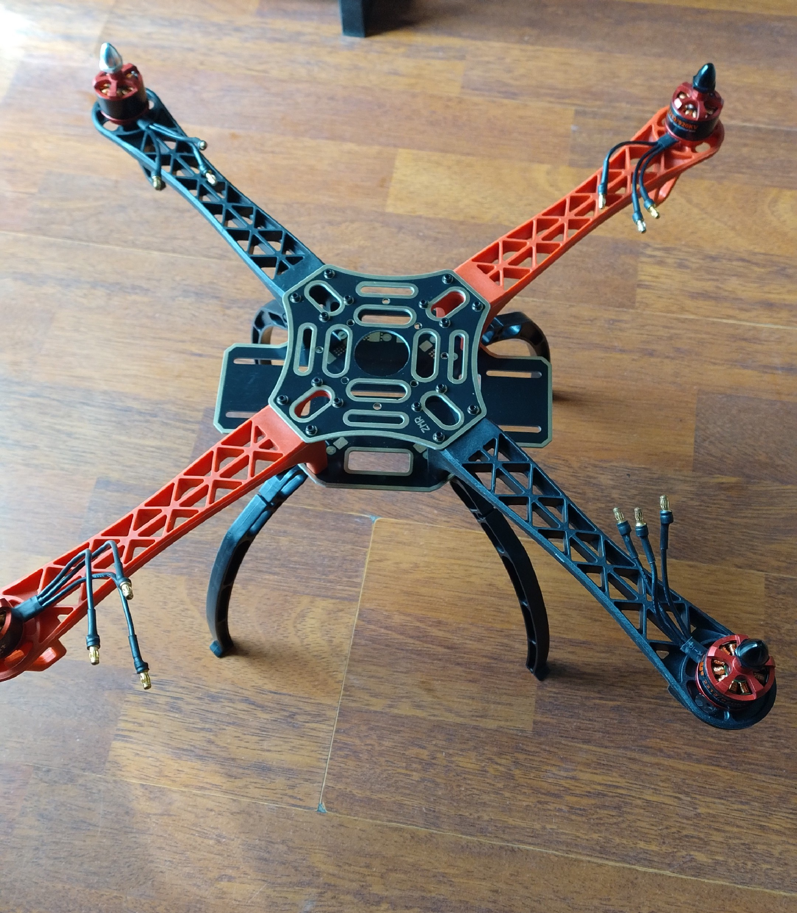

# 🚁 UAV with PID Control ⚠️ *Work in Progress*

## 📖 Overview
This DIY UAV (Unmanned Aerial Vehicle) project is being developed with an automatic control loop using PID controllers.  
The system controls angular position (Pitch and Roll) and angular velocity (Pitch, Roll and Yaw) to achieve stable and precise flight.  

During development, the signal-to-noise ratio (S/N) of measurements was improved, and the stability of the electronic circuitry was enhanced. Brushless motors are used for propulsion, and a Teensy microcontroller handles the control loop in real time. Feedback is provided by gyroscopes and accelerometers, enabling precise stabilization and responsiveness to disturbances.

> ⚠️ **Note:** This project is currently under development. Features and hardware are subject to change.

## 📊 Project Status
| Component                  | Status                     |
|-----------------------------|----------------------------|
| Brushless Motors Setup      | ✅ Completed               |
| Sensor Signal Calibration   | ✅ Completed               |
| Teensy PID Control Loop     | ⚙️ In Progress             |
| Pitch, Roll & Yaw Angular Velocity Control| ⚙️ In Progress             |
| Pitch & Roll Stabilization  | ⚙️ In Progress             |
| Model Development          | ⚙️ In Progress               |
| Prototype Flight Testing    | ⚠️ Not Started             |

## 📂 Contents
- `/docs` → photos and setup diagrams.

## 🌐 YouTube
📺 [Short Video 1](https://youtube.com/shorts/LwX8zSV23eY?feature=share)

📺 [Short Video 2](https://youtube.com/shorts/dZo7ZcapqBg?feature=share)

📺 [Short Video 3](https://youtube.com/shorts/Z043N4uVOiI?feature=share)

## 🔄 Control Loops

### Controlled Variables
- **Pitch & Roll** → Angular position control (stabilization)
- **Pitch, Roll & Yaw** → Angular velocity control (rotation rate)

## 📐 Digital PID Control

The Module uses a discrete PI and P controller implemented on a Teensy microcontroller.  

### P controller:
Digital P controller in outer loop is implemented for Roll and Pitch angles,

$$
error_{posRoll}=Ref_{Roll}-Angle_{Roll}
$$
$$
error_{posPitch}=Ref_{Pitch}-Angle_{Pitch}
$$
$$
error_{rateRoll}=K_{Roll} \cdot error_{posRoll}
$$
$$
error_{posPitch}=K_{Pitch} \cdot error_{posPitch}
$$

#### Parameters P Controller:

The parameters are adjusted for each of the angles, $$K_{Roll}$$ and $$K_{Pitch}$$.

### PI controller:
The control law for a PI controller in the digital domain is expressed as:

$$
u(n) = u(n-1) + K_0 e(n) + K_1 e(n-1)
$$

Digital PI controller in inner loop is implemented for Roll, Pitch and Yaw rates,

$$
error_{RateRoll}=Ref_{rateRoll}-Rate_{Roll}
$$
$$
error_{RatePitch}=Ref_{ratePitch}-Rate_{Pitch}
$$
$$
error_{RateYaw}=Ref_{rateYaw}-Rate_{Yaw}
$$

$$
u_{RollRate}(n) = u_{RollRate}(n-1) + K_0 \cdot error_{RateRoll}(n) + K_1 \cdot error_{RateRoll}(n-1)
$$
$$
u_{PitchRate}(n) = u_{PitchRate}(n-1) + K_0 \cdot error_{RatePitch}(n) + K_1 \cdot error_{RatePitch}(n-1)
$$
$$
u_{YawRate}(n) = u_{YawRate}(n-1) + K_0 \cdot error_{RateYaw}(n) + K_1 \cdot error_{RateYaw}(n-1)
$$

#### Parameters PI controller:

The parameters are adjusted for each of the angular rates,

$$
K_0 = K_p + \frac{K_p}{2T_i} T_s
$$

$$
K_1 = -K_p + \frac{K_p}{2T_i} T_s
$$

#### Control Signal Inner Loop:

$$
motor_1=u_{PWR}-u_{RollRate}-u_{PitchRate}-u_{YawRate}
$$
$$
motor_2=u_{PWR}-u_{RollRate}+u_{PitchRate}+u_{YawRate}
$$
$$
motor_3=u_{PWR}+u_{RollRate}+u_{PitchRate}-u_{YawRate}
$$
$$
motor_4=u_{PWR}+u_{RollRate}-u_{PitchRate}+u_{YawRate}
$$

## 🔉 Signal Processing: 1D Kalman Filter  

To improve the accuracy of angular position (Pitch, Roll) measurements, a **1D Kalman Filter** was implemented.  
This filter provides an optimal estimation by combining sensor measurements with a predictive model, effectively reducing noise and improving stability for the control loop.  

### 🔹 Filter Equations  

**Prediction step:** 

$$
\hat{x}_{k|k-1} = \hat{x}_{k-1|k-1}
$$  

$$
P_{k|k-1} = P_{k-1|k-1} + Q
$$  

**Update step:**  

$$
K_k = \frac{P_{k|k-1}}{P_{k|k-1} + R}
$$  

$$
\hat{x}_{k|k} = \hat{x}_{k|k-1} + K_k \big(z_k - \hat{x}_{k|k-1}\big)
$$  

$$
P_{k|k} = (1 - K_k) P_{k|k-1}
$$  

Where:  
- $$( \hat{x}_{k|k})$$: estimated state (filtered measurement)  
- $$z_k$$: raw sensor measurement  
- $$P$$: error covariance  
- $$Q$$: process noise covariance  
- $$R$$ : measurement noise covariance  
- $$K_k$$: Kalman gain  

## 🔉 Signal Processing: 1D Kalman Filter (Mathematical Formulation)

The following equations describe the discrete-time 1D Kalman filter used in the UAV project.  
Sampling time: \( T_s = 0.005 \, s \) (200 Hz).  

### 🔹 Prediction step  

State prediction (integration of gyro angular rate):  

$$
\hat{x}_{k|k-1} = \hat{x}_{k-1|k-1} + T_s \cdot u_k
$$  

Uncertainty prediction:  

$$
P_{k|k-1} = P_{k-1|k-1} + T_s^2 \cdot \sigma_{\dot{\theta}}^2
$$  

where:  
- \( u_k \): gyro input (angular rate)  
- \( \sigma_{\dot{\theta}} = 4^\circ/s \) (gyro noise standard deviation)  

---

### 🔹 Update step  

Kalman gain:  

$$
K_k = \frac{P_{k|k-1}}{P_{k|k-1} + \sigma_\theta^2}
$$  

State update (fusion with accelerometer measurement):  

$$
\hat{x}_{k|k} = \hat{x}_{k|k-1} + K_k \left(z_k - \hat{x}_{k|k-1}\right)
$$  

Uncertainty update:  

$$
P_{k|k} = (1 - K_k) \, P_{k|k-1}
$$  

where:  
- $$  z_k $$ : accelerometer measurement (angle)  
- \( \sigma_\theta = 3^\circ \) (accelerometer noise standard deviation)  

## 🖼️ 3D PCB Render Version 4

## 🖼️ UAV Prototype

## 📜 License
MIT License
