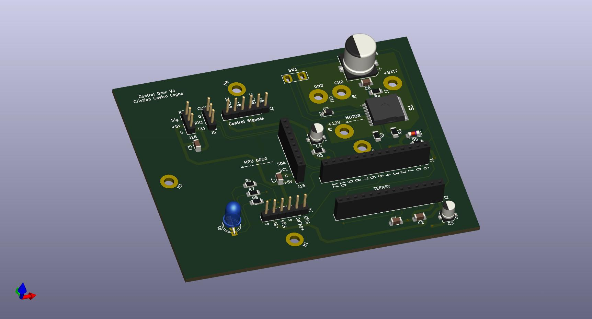
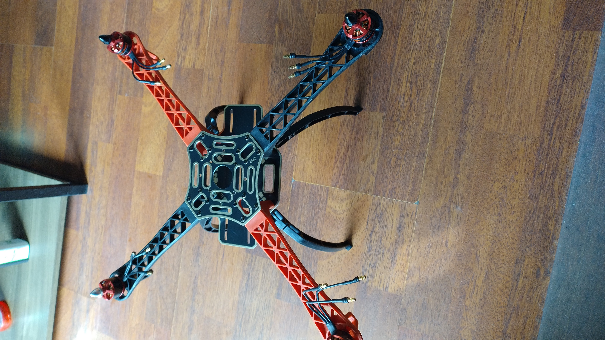
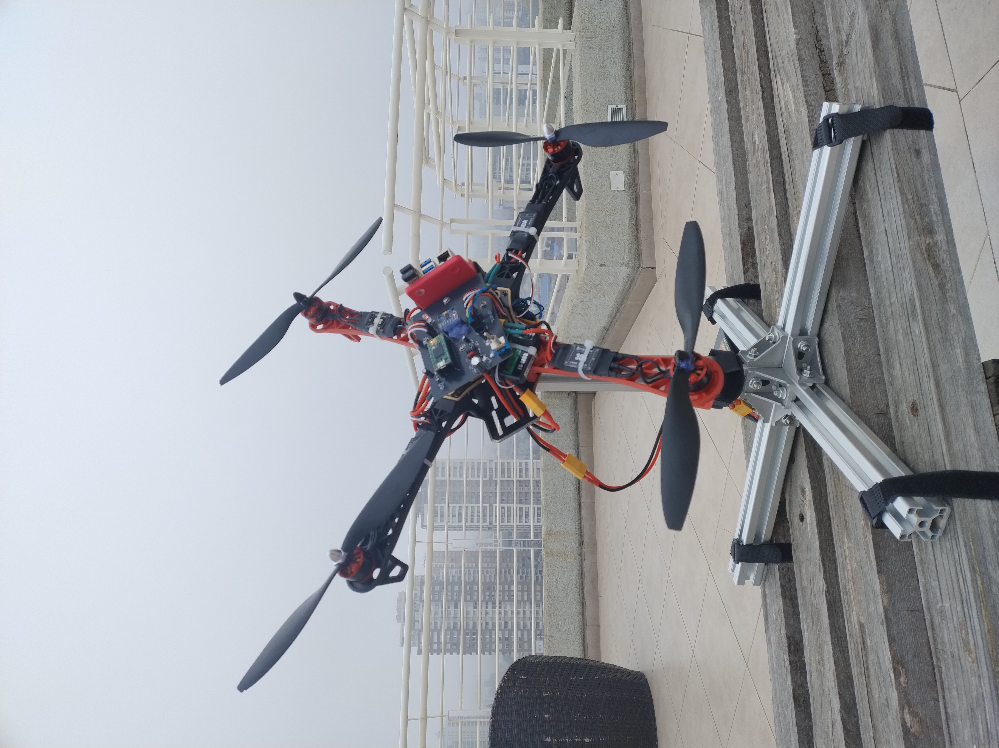

# 🚁 DIY UAV with PID Control ⚠️ *Work in Progress*

## 📖 Overview
This DIY UAV (Unmanned Aerial Vehicle) project is being developed with an automatic control loop using PID controllers.  
The system controls angular position (Pitch and Roll) and angular velocity (Yaw) to achieve stable and precise flight.  

During development, the signal-to-noise ratio (S/N) of measurements was improved, and the stability of the electronic circuitry was enhanced. Brushless motors are used for propulsion, and a Teensy microcontroller handles the control loop in real time. Feedback is provided by gyroscopes and accelerometers, enabling precise stabilization and responsiveness to disturbances.

> ⚠️ **Note:** This project is currently under development. Features and hardware are subject to change.

## 📊 Project Status
| Component                  | Status                     |
|-----------------------------|----------------------------|
| Brushless Motors Setup      | ✅ Completed               |
| Sensor Signal Calibration   | ✅ Completed               |
| Teensy PID Control Loop     | ⚙️ In Progress             |
| Pitch & Roll Stabilization  | ⚙️ In Progress             |
| Yaw Angular Velocity Control| ⚙️ In Progress             |
| Model Development          | ⚙️ In Progress               |
| Prototype Flight Testing    | ⚠️ Not Started             |

## 📂 Contents
- `/docs` → photos and setup diagrams.

## 🔄 Control Loops

### Controlled Variables
- **Pitch & Roll** → Angular position control (stabilization)
- **Yaw** → Angular velocity control (rotation rate)

## 📐 Digital PID Control

The Module uses a discrete PI controller implemented on a Arduino microcontroller.  
The control law in the digital domain is expressed as:

$$
u(n) = u(n-1) + K_0 e(n) + K_1 e(n-1)
$$
Digital PI controller implemented for Poll and Pitch rate,
$$
u_{RollRate}(n) = u_{RollRate}(n-1) + K_0 e(n) + K_1 e(n-1)
$$
$$
u_{PitchRate}(n) = u_{PitchRate}(n-1) + K_0 e(n) + K_1 e(n-1)
$$
### Parameters:

The parameters are adjusted for each of the angular rates,

$$
K_0 = K_p + \frac{K_p}{2T_i} T_s
$$

$$
K_1 = -K_p + \frac{K_p}{2T_i} T_s
$$

## 🖼️ 3D PCB Render Version 4

## 🖼️ UAV Prototype

## 🌐 YouTube
📺 [Short Video 1](https://youtube.com/shorts/LwX8zSV23eY?feature=share)

📺 [Short Video 2](https://youtube.com/shorts/dZo7ZcapqBg?feature=share)

📺 [Short Video 3](https://youtube.com/shorts/Z043N4uVOiI?feature=share)

## 📜 License
MIT License
